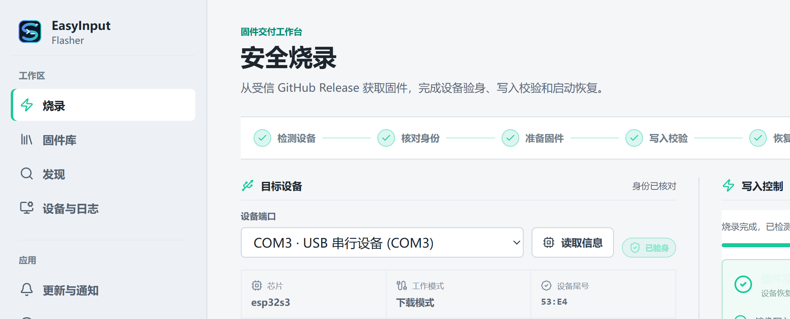

# EasyInput Flasher

EasyInput Flasher 是 EasyInput V2.0 的固件烧录与硬件诊断工具。它支持受信 GitHub Release、本地标准固件包和 Factory 恢复，在本机校验版本化 manifest、SHA-256 与设备身份后，完成地址级写入、恢复检查和板级体检。

它不在电脑上编译固件、不上传设备数据、不执行 OTA，也不会默认擦除 Flash。



> 图中展示设备检测、身份核对和烧录恢复流程。实际写入目标始终以界面和运行状态中显示的 manifest tag 为准。

## 下载安装

1. 打开 [Releases](https://github.com/FreeCodeCampXYG/easyinput-flasher/releases)，下载与系统架构匹配的归档。
2. Windows 通常选择 `windows-x64.zip`；ARM Windows 才选择 `windows-arm64.zip`。
3. 解压后运行 `easyinput-flasher.exe`。应用未签名时，Windows/macOS 可能要求你在系统安全提示中明确确认运行。
4. 发布页提供同名 `.sha256` 文件；下载后建议校验归档完整性。

Windows x64 是当前完成本机构建验证的目标。其他平台由 GitHub Actions 原生 runner 打包；CI 成功不等同于真实设备烧录已验证。

### Windows 安全提示与误报

当前 Windows 包尚未使用代码签名证书，因此 SmartScreen 的“未知发布者”提示不等于文件已被判定为恶意软件。只有在**从本项目官方 [Releases](https://github.com/FreeCodeCampXYG/easyinput-flasher/releases) 下载**，并且 ZIP 的 SHA-256 与同名 `.sha256` 文件一致时，才应继续运行。

在解压目录打开 PowerShell，执行以下命令校验下载的 ZIP；输出的哈希必须与 Release 页面中的 `.sha256` 文件完全一致：

```powershell
Get-FileHash .\easyinput-flasher-v<版本>-windows-x64-portable.zip -Algorithm SHA256
```

若 Windows Defender 隔离了已校验的 `easyinput-flasher.exe`，请在“Windows 安全中心 -> 保护历史记录”确认文件名、Release 版本和 SHA-256 后，再选择“允许在设备上”。不要关闭实时防护，也不要给整个磁盘或下载目录添加排除项。请在 [Issue](https://github.com/FreeCodeCampXYG/easyinput-flasher/issues) 附上拦截名称、Defender 版本、Release 版本和 ZIP SHA-256；不要上传设备日志、MAC 地址或其他隐私数据。

开发者自行编译时如遇误报，只应为自己的 `build\bin` 输出目录建立临时精确排除项。该开发环境做法不适用于下载者，也不能替代发布包校验。

## 第一次烧录

准备条件：EasyInput V2.0 / ESP32-S3、支持数据传输的 USB 线，以及可访问 GitHub Release 的网络环境。

1. **连接并检测**：设备正常开机后连接 USB，点击“重新检测”。正常 HID/BLE 只说明设备在线，不代表已经进入下载模式。
2. **进入下载模式**：保持开机，短按并松开一次 BOOT，再点击“刷新下载端口”。不要按住 BOOT 后再上电。
3. **读取身份**：选择出现的 COM 下载端口并读取信息。应用会确认 ESP32-S3 和脱敏 MAC 尾号。
4. **选择版本**：在“目标固件”中选择带有 `firmware-manifest.json` 的 Release。下拉框、进度状态和完成页都会显示实际写入的 manifest tag。
5. **确认写入**：输入界面要求的完整确认文本。写入期间不要拔 USB、关闭电源或再次按 BOOT。
6. **恢复启动**：写入完成后关机，再正常开机。应用会检查预期 HID 是否恢复。

```text
连接设备 -> 短按 BOOT -> 刷新下载端口 -> 读取身份
-> 选择 Release -> 输入确认文本 -> 写入 -> 关机再正常开机
```

烧录完成、HID 恢复、按键/BLE/音频等具体功能验证是三种不同证据。请不要把“写入成功”当作所有功能均已验证。

## 固件版本与社区玩法

- **还原官方 main**：选择官方发布的 `firmware-v*-main` Release。它是特定 main 提交的构建产物，不是“恢复出厂设置”，不会默认清空设备配置。
- **体验其他分支或 Fork**：只选择公开 GitHub Release，确认仓库、tag、commit、板型与变更说明。不要烧录分支名、任意 URL 或裸 `.bin`。
- **自己发布可烧录版本**：Fork 后在 GitHub Actions 构建并发布 manifest、三段镜像、SHA256SUMS 和构建溯源。完整合同见 [固件发布规范](docs/FIRMWARE_PUBLISHING.md)。
- **从 Fork 开始的图文教程**：[社区固件：从 Fork 到烧录](docs/COMMUNITY_FIRMWARE_GUIDE.md)。
- **受信边界**：未审核来源不能绕过桌面端直接写入；manifest 只能写入标准 bootloader、分区表与应用三段。

## 遇到问题

| 现象 | 处理 |
| --- | --- |
| 检测到正常 HID，但没有下载串口 | 保持开机，短按并松开 BOOT，再刷新下载端口。 |
| 下载端口没有出现 | 检查数据线、供电和系统端口列表；不要切换到“按住 BOOT 上电”。 |
| 芯片或板型不匹配 | 立即停止，选择正确的 ESP32-S3 设备。 |
| 固件校验失败 | 不要绕过 manifest 或哈希；删除缓存后重试并提交脱敏诊断。 |
| 写入后仍处于下载模式 | 不要再次按 BOOT；关机后正常开机。 |
| HID 没有恢复 | 确认已彻底断电重启，再收集脱敏日志提交 Issue。 |

更完整的边界与故障说明见 [故障排查](docs/TROUBLESHOOTING.md)。

## 参与共建

欢迎提交设备兼容性结果、文档、测试和代码。提交前请阅读 [贡献指南](CONTRIBUTING.md)：Issue 使用“类型 + 模块 + 平台 + 优先级”标签，PR 必须通过 CI 并由非作者维护者审核。安全问题请按 [SECURITY.md](SECURITY.md) 私下报告，不要创建公开 Issue。

## 文档

- [架构](docs/ARCHITECTURE.md)
- [本地开发与构建](docs/BUILDING.md)
- [发布流程](docs/RELEASING.md)
- [固件发布规范](docs/FIRMWARE_PUBLISHING.md)
- [社区固件图文教程](docs/COMMUNITY_FIRMWARE_GUIDE.md)
- [故障排查](docs/TROUBLESHOOTING.md)
- [变更日志](CHANGELOG.md)

应用内“更新与通知”页面也提供按版本排列的可视化时间轴，展示每个版本的功能变化与后续规划。

## 许可证

自有代码采用 [PolyForm Noncommercial 1.0.0](LICENSE)，版权归 StarLine，仅允许该许可证定义的非商业用途。固件和纯 Go 烧录依赖保留其各自上游许可证，详见 [第三方声明](THIRD_PARTY_NOTICES.md)。
