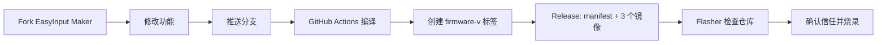

# 社区固件：从 Fork 到烧录

这是一份给第一次使用 GitHub Actions 的贡献者的教程。你不需要在自己的电脑安装 ESP-IDF；GitHub 会在云端编译，EasyInput Flasher 只下载通过检查的发布包。



## 第 1 步：Fork

1. 打开 `FreeCodeCampXYG/easy-input-maker`。
2. 点击右上角 **Fork**，选择自己的 GitHub 账号。
3. 在自己的仓库中创建一个新分支，例如 `my-light-effect`。

不要在 Flasher 里填分支名。分支只是源代码，不能直接烧录。

## 第 2 步：修改并推送

1. 只修改你要尝试的功能。
2. 提交并推送到自己的分支。
3. 打开 GitHub 的 **Actions** 页面，确认基础构建与测试是绿色。

如果 Actions 红色，先按失败日志修好代码。红色不代表软件坏了，只表示 GitHub 没能成功把源代码做成固件。

## 第 3 步：发布可烧录版本

当分支测试通过后，创建一个符合 `firmware-v*` 规则的新 tag，例如：

```text
firmware-v0.1.0-my-light-effect
```

推送 tag 后，发布工作流会自动生成：

| 文件 | 用处 |
| --- | --- |
| `firmware-manifest.json` | 告诉 Flasher 这是什么板、写到哪里、每个文件的 SHA-256。 |
| `bootloader.bin` | ESP32-S3 启动程序。 |
| `partition-table.bin` | Flash 分区表。 |
| `easy_input_keyboard.bin` | 你的 EasyInput 功能程序。 |
| `SHA256SUMS.txt` | 供人工复核下载文件是否完整。 |

缺少其中任意一个文件，Flasher 都不会把它列为可烧录固件。这是在保护设备，不是报错。

## 第 4 步：让 Flasher 检查仓库

1. 打开 Flasher 的 **发现** 页面。
2. 输入你的 GitHub 仓库，格式是 `owner/repository`，例如 `xiaoming/easy-input-maker`。
3. 点击 **检查仓库**。
4. 软件会显示三项结果：可烧录 Release、自动发布工作流、manifest 生成脚本。
5. 如果已找到完整 Release，输入界面指定的“信任来源 owner/repository”文本，点击 **信任并加入**。
6. 前往 **固件库**，刷新列表，选择刚发布的 tag。

软件不会因为你输入了仓库就自动写入设备。加入来源只代表你授权该仓库的标准 Release 进入选择列表；每一次真正写入仍会重验设备、下载 manifest、计算 SHA-256，并要求输入 MAC 确认文本。

## 第 5 步：烧录并验证

1. 设备正常开机，连接数据线。
2. 在 Flasher 中重新检测；短按并松开 BOOT，再刷新下载端口。
3. 读取 ESP32-S3 和 MAC 尾号。
4. 选择自己的 tag，确认右侧状态显示的版本就是你要体验的版本。
5. 输入确认文本，等待写入完成。
6. 关机后正常开机，确认 HID 恢复，再按你的功能清单验证按键、BLE、音频等。

> 写入成功只表示三个镜像被工具校验写入。你新增的功能是否正常，仍需要实际操作验证。

## 常见问题

| 看到的提示 | 下一步 |
| --- | --- |
| 没有可烧录 Release | 先创建并推送 `firmware-v*` tag，等 Actions 成功。 |
| 缺自动发布工作流或 manifest 脚本 | 从官方仓库同步 `.github/workflows/firmware-release.yml` 和 `scripts/build_firmware_manifest.py`，再提交到自己的仓库。 |
| Release 缺镜像 | 如果只有 `factory.bin`，Flasher 会识别并提示，但不会自动拆分或猜测偏移；请运行仓库 Actions 生成三段镜像、`firmware-manifest.json` 和 `SHA256SUMS.txt` 后再检查。 |
| 烧录后界面显示别的版本 | 先升级 Flasher；完成页应保留你实际选择的 manifest tag。 |
| 想让更多人试用 | 在 Issue 中创建 Firmware source proposal，提供公开 Release URL、commit 和已验证范围。 |
